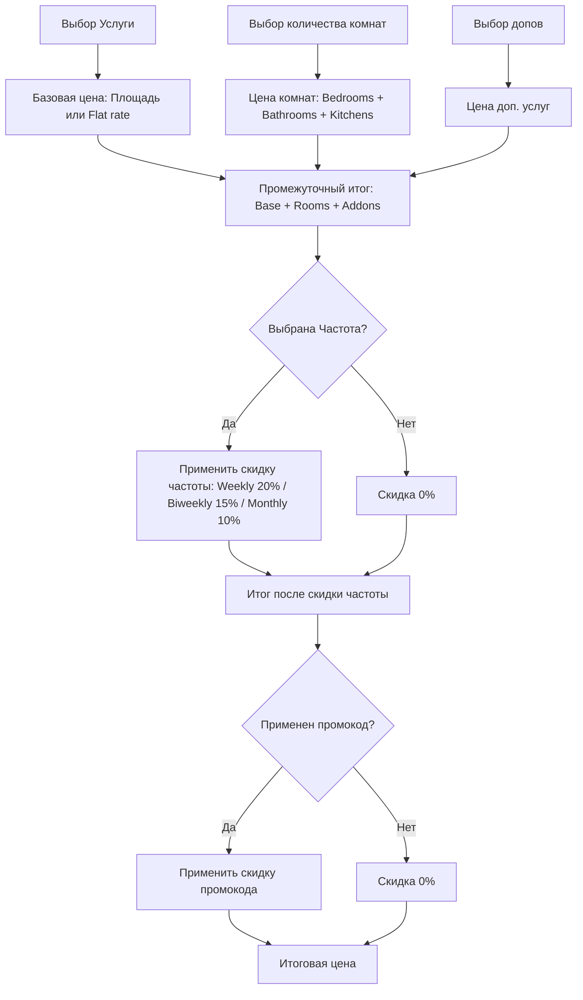

# Спецификация Архитектуры клинингового сервиса (Новый функционал)

Этот документ описывает техническое проектирование и планирование изменений в базе данных Prisma, API и пользовательском интерфейсе для интеграции профессионального и универсального функционала: Дополнительные опции, Периодичность услуг, Расчет по комнатам, Описания услуг и Админка.

---

## 1. Изменения в Базе Данных (Prisma Schema)

Для поддержки новых фич мы расширим текущие модели `ServiceType` и `CleaningOrder`, а также создадим новую модель `ServiceAddon`.

### Схема Prisma (`prisma/schema.prisma`)

```prisma
// ==========================================
// Новая модель дополнительных услуг (Add-ons)
// ==========================================
model ServiceAddon {
  id            String       @id @default(cuid())
  name          String
  description   String?
  price         Float
  icon          String?      // Например, emoji " Fridge" 
  isActive      Boolean      @default(true)
  createdAt     DateTime     @default(now())
  updatedAt     DateTime     @updatedAt

  // Привязка к типу услуги (если null, то опция глобальная и доступна везде)
  serviceTypeId String?
  serviceType   ServiceType? @relation(fields: [serviceTypeId], references: [id], onDelete: Cascade)
}

// ==========================================
// Обновления в существующих моделях
// ==========================================

model ServiceType {
  id            String          @id @default(cuid())
  slug          String          @unique
  name          String
  description   String?
  icon          String?
  basePrice     Float           // Стартовая цена услуги
  pricePerSqm   Float?          // Цена за кв. м.
  minArea       Float?
  maxArea       Float?
  durationHours Float           @default(2)
  isActive      Boolean         @default(true)
  sortOrder     Int             @default(0)
  createdAt     DateTime        @default(now())
  updatedAt     DateTime        @updatedAt

  // --- Новые поля для ценообразования по комнатам ---
  pricePerBedroom  Float?       @default(0)
  pricePerBathroom Float?       @default(0)
  pricePerKitchen  Float?       @default(0)

  // Связи
  orders        CleaningOrder[]
  addons        ServiceAddon[]   // Отношение один-ко-многим для допов
}

model CleaningOrder {
  id              String          @id @default(cuid())
  orderNumber     String          @unique @default(cuid())
  
  userId          String
  serviceTypeId   String
  addressId       String?
  cleanerId       String?

  // Детали уборки
  areaSize        Float?          // Площадь в кв. м.
  roomCount       Int?            // Общее количество комнат (для обратной совместимости)
  
  // --- Новые поля для детального учета комнат ---
  bedroomsCount   Int?            @default(0)
  bathroomsCount  Int?            @default(0)
  kitchensCount   Int?            @default(0)

  specialRequests String?
  accessNotes     String?

  // Расписание
  scheduledDate   DateTime
  scheduledTime   String
  frequency       ServiceFrequency @default(ONE_TIME)

  // Адрес
  addressStreet   String
  addressCity     String
  addressPostal   String?

  // Ценообразование
  basePrice       Float
  discount        Float           @default(0)
  totalPrice      Float

  // --- Сохраненные допы (Денормализация в JSON для сохранения истории цен) ---
  addons          Json?           // Массив объектов: [{ id: string, name: string, price: number, icon: string }]

  // Оплата
  paymentMethod   PaymentMethod   @default(STRIPE)
  paymentStatus   PaymentStatus   @default(UNPAID)
  stripeSessionId String?
  stripePaymentId String?
  paidAt          DateTime?

  // Статус
  status          OrderStatus     @default(PENDING)
  confirmedAt     DateTime?
  startedAt       DateTime?
  completedAt     DateTime?
  cancelledAt     DateTime?
  cancellationReason String?

  createdAt       DateTime        @default(now())
  updatedAt       DateTime        @updatedAt

  user            User            @relation(fields: [userId], references: [id])
  serviceType     ServiceType     @relation(fields: [serviceTypeId], references: [id])
  address         Address?        @relation(fields: [addressId], references: [id])
  cleaner         CleanerProfile? @relation(fields: [cleanerId], references: [id])
  review          Review?
}
```

### Безопасность и Обратная Совместимость
* **Значения по умолчанию**: Все новые поля в `ServiceType` и `CleaningOrder` объявляются как опциональные или имеют значение `@default(0)` / `@default(ONE_TIME)`. При миграции существующие записи в БД не сломаются.
* **JSON для допов в заказе**: Хранение допов в виде `Json?` в таблице `CleaningOrder` гарантирует, что если администратор изменит цену допа или удалит его из системы в будущем, исторический чек заказа не изменится, и расчетные данные сохранятся в первозданном виде.

---

## 2. Логика Ценообразования и Расчетов (Calculator Logic)

Интегрированная формула калькулятора на клиенте и сервере (в API) будет работать согласованно.

### Формула Расчета

```
Базовая Цена Услуги = 
  Если (pricePerSqm задан и areaSize задан):
    max(areaSize, minArea) * pricePerSqm
  Иначе:
    basePrice

Цена Комнат = 
  (bedroomsCount * pricePerBedroom) + 
  (bathroomsCount * pricePerBathroom) + 
  (kitchensCount * pricePerKitchen)

Цена Допов = 
  Сумма(выбранные доп. услуги.price)

Промежуточный Итог (Subtotal) = 
  Базовая Цена Услуги + Цена Комнат + Цена Допов

Скидка за Частоту = 
  Промежуточный Итог * (Процент Скидки Частоты / 100)

Промежуточный Итог после Скидки Частоты = 
  Промежуточный Итог - Скидка за Частоту

Скидка по Промокоду = 
  Промежуточный Итог после Скидки Частоты * (Процент Скидки Промокода / 100)

Итоговая Стоимость (Total Price) = 
  Промежуточный Итог после Скидки Частоты - Скидка по Промокоду

Общая Сумма Скидки (Total Discount) = 
  Скидка за Частоту + Скидка по Промокоду
```

### Глобальные константы авто-скидок за периодичность (`lib/constants.ts`)

```typescript
export const FREQUENCY_DISCOUNTS: Record<string, number> = {
  ONE_TIME: 0,
  WEEKLY: 20,    // 20%
  BIWEEKLY: 15,  // 15%
  MONTHLY: 10,   // 10%
}
```

---

## 3. Проектирование API (`app/api/booking/create/route.ts`)

Мы обновим эндпоинт бронирования для поддержки новых параметров:
* Входные данные: `bedroomsCount`, `bathroomsCount`, `kitchensCount`, `frequency`, `addons` (массив ID выбранных допов).
* Загрузка допов из базы данных по переданным ID для исключения манипуляции ценами со стороны клиента.
* Точный пересчет стоимости на бэкенде перед оплатой / интеграцией со Stripe.

### Структура API запроса (POST)
```json
{
  "serviceSlug": "deep-cleaning",
  "areaSize": "75",
  "bedroomsCount": "2",
  "bathroomsCount": "1",
  "kitchensCount": "1",
  "frequency": "WEEKLY",
  "addons": ["addon-id-fridge", "addon-id-oven"],
  "scheduledDate": "2026-07-01",
  "scheduledTime": "10:00",
  "addressStreet": "123 Main St",
  "addressCity": "New York",
  "addressPostal": "10001",
  "specialRequests": "Please bring eco-friendly products",
  "accessNotes": "Code 1234",
  "paymentMethod": "STRIPE",
  "name": "John Doe",
  "email": "john@example.com",
  "phone": "+15551234567"
}
```

---

## 4. Проектирование Пользовательского Интерфейса (UI)

### А. Форма Бронирования (`components/booking/BookingForm.tsx`)

#### Шаг 1: Выбор услуги и Частота
* Добавим ссылку/кнопку "What is included?" (с иконкой ℹ️) рядом с каждым типом услуги. При клике будет разворачиваться описание услуги (`service.description`), стилизованное в виде раскрывающегося аккордеона.
* Добавим выбор периодичности (Service Frequency) с красивыми переключателями (Radio Group) и зелеными бейджами скидок:
  * *Once* (No discount)
  * *Weekly* (Save 20%)
  * *Biweekly* (Save 15%)
  * *Monthly* (Save 10%)

#### Шаг 2: Детали бронирования
* Если у выбранной услуги заданы цены на комнаты (`pricePerBedroom` / `pricePerBathroom`), мы заменяем стандартное плоское поле "Rooms" на интуитивно понятные интерактивные счетчики (минус / плюс) для:
  * Спальни (Bedrooms)
  * Ванные (Bathrooms)
  * Кухни (Kitchens) — если задана цена `pricePerKitchen`.
* Секция **"Customize Your Clean" (Add-ons / Extras)**:
  * Отображается в виде сетки (grid) карточек-чекбоксов.
  * Каждая карточка содержит: emoji/иконку, название допа, краткое описание (например, "Inside fridge") и цену (например, "+$25").
  * Динамически отображаются только те допы, которые либо глобальные (`serviceTypeId === null`), либо привязаны к выбранному типу услуги.

#### Шаг 3: Сводка заказа (Order Summary)
* Будет детально расписывать все составляющие стоимости:
  * Базовая стоимость (услуга + площадь)
  * Добавка за спальни/ванные: `2 Bedrooms (+$50)`, `1 Bathroom (+$30)`
  * Выбранные допы: `Clean Fridge (+$25)`
  * Скидка за частоту: `Weekly Discount 20% (-$37.00)`
  * Промокод: `SUMMER10 (-$14.80)`
  * Итоговый результат.

---

## 5. Доработка Панели Администратора

Административная панель будет обновлена для полноценного управления всей этой конфигурацией:

1. **Управление Услугами (`app/(dashboard)/admin/services/[id]/page.tsx`)**:
   * Добавление полей ввода цен за спальню (`pricePerBedroom`), ванную (`pricePerBathroom`) и кухню (`pricePerKitchen`).
2. **Новый раздел управления Допами (`app/(dashboard)/admin/addons/page.tsx` и `new/page.tsx`)**:
   * Страница со списком всех допов, привязкой к услугам, включением/выключением и редактированием цены.
   * Экшены для создания, обновления и удаления допов.
3. **Детали Заказа (`app/(dashboard)/admin/orders/[id]/page.tsx`)**:
   * Отображение количества спален/ванных/кухонь.
   * Вывод выбранных доп. услуг (считанных из денормализованного поля `addons` заказа) списком с ценами.
   * Детализация расчетов (скидка за частоту, базовая стоимость комнат).

---

## 6. Mermaid-диаграмма процессов расчета цены


